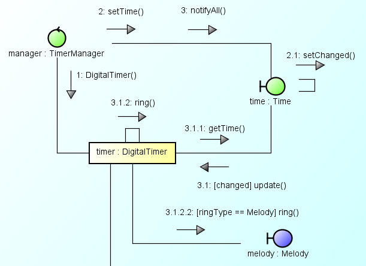
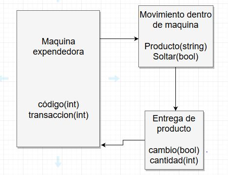

# Tarea 1

## Unidad 1: Introducción al paradigma de la programación orientado a objetos

***

### *Paradigma*: Un paradigma es un seguimiento que hace una persona, en base sus creencias adquiridas previamente ante la situacion que se le presenta. En programación, un paradigma es, en resumen, aquellas normas que todo programador debe seguir de forma exacta

***

### *Abstracción*: Aislar la mayoria de las cualidades de algo, para enfocarse en un solo punto. En programación, en esencia es lo mismo. Enfocar alguna caracteristica de un objeto, de manera que se nos sea mas sencillo trabajar

#### Ejemplo 1: En programación, tener los datos de una persona (nombre, edad, genero, estatura, etc), pero la institucion a la que se esta inscribiendo solo necesita su nombre y su edad, por lo que los demas datos de esa persona no se toman en cuenta

#### Ejemplo 2: En matematicas, se tienen 20 sillas blancas de plastico, y se quieren acomodar entre 5 mesas de madera con manteles rojos. En estos casos, lo unico necesario para dar con el resultado, es el ignorar completamente los datos que no sean numericos(color de las sillas, material de las mesas, etc), ya que estos no sirven para la resolución del problema

***

### Explica el concepto de encapsulamiento, busca dos imágenes que te ayuden a describir el concepto, una que tenga algún sistema sin encapsulamiento y otra donde si lo tenga. Menciona por que es importante y que problemas puede evitar

#### Encapsulamiento, es la manipulación de los atributos de una clase, de manera que estos puedan ser modificados o no por otros usuarios

#### Esto sirve para que los usuarios que interactuen con tu programa, tengan poco o nulo acceso a detalles del mismo, que tu no quieras o que no se deban alterar, ya sea para mantener el programa funcionando u otros motivos

***

### Describe con tus palabras el concepto de herencia e ilustra el concepto con imágenes

#### La herencia en programación, consiste en que una sub clase (una clase dentro de una clase) adopte los mismos atributos que la clase primaria, teniendo esta la particularidad de adaptarse facilmente a los cambios de la clase

***

## UML: diagrama de clases

### El Lenguaje Unificado de Modelado (Unifield Modeling Lenguaje UML), es un lenguaje estándar para escribir planos de software, UML se puede utilizar para visualizar, especificar, construir y documentar los artefactos de un sistema que involucra una gran cantidad de software. UML se puede usar para modelar distintos tipos de sistemas como por ejemplo: sistemas de software, sistemas de hardware, y organizaciones del mundo real. UML ofrece nueve diagramas en los cuales modelar sistemas. Es un lenguaje muy expresivo,  que  cubre  todas  las vistas  necesarias  para  desarrollar y luego desplegar tales sistemas.           UML es sólo un lenguaje y por tanto es tan solo una parte de un método de desarrollo de software

### El lenguaje UML comenzó a gestarse en octubre de 1994, cuando Rumbaugh se unió a la compañía Rational fundada por Booch (dos reputados investigadores en el área de metodología del software). El objetivo de ambos era unificar dos métodos que habían desarrollado: el método Booch y el OMT (Object Mode-lling Tool ). El primer borrador apareció en octubre de 1995. En esa misma época otro reputado investigador, Jacobson, se unió a Rational y se incluyeron ideas suyas; Este lenguaje se abrió a la colaboración de otras empresas para que aportaran sus ideas. Todas estas colaboraciones condujeron a la definición de la primera versión de UML

### Entre algunas herramientas para el modelado en UML, destacan GenMyModel, Gliffy, draw.io y diagramo, por mencionar algunos

***

