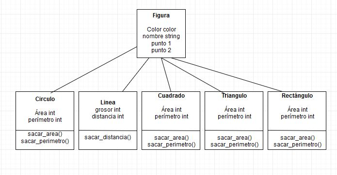

# Tarea 3

## **Unidad 3. Herencia**

***

### *Define: Clase Base, Clase Derivada*

#### La clase base es una clase que se genera cuando en nuestro programa, notamos que las clases que se crearán tienen caracteristicas en común, por lo qué, para ahorrar espacio, se genera una clase madre que tenga esas caracteristicas. Una clase derivada, es aquella clase que adquiere las caracteristicas de la base madre, pero teniendo alguna distinción entre las demas clases derivadas.

***

### *Haz un diagrama UML donde se muestre la relación de herencia entre las  clases Figura, Recangulo y Circulo como vimos en clase*

***

### Indica cuales son las clases base y las derivadas

#### Las clases base son aquellas clases que tienen propiedades que pueden ser aplicadas para otras clases. Las clases derivadas son aquellas clases que adoptan las caracteristicas de una clase base, pero teniendo ya definidas otras propiedades, para que esta se pueda diferenciar de otras clases derivadas.

***

### ¿Que es herencia simple y herencia múltiple? ¿En c# se puede hacer herencia múltiple?

#### La herencia simple consta de definir nuevas clases, a partir de una clase madre, mientras que la herencia multiple, puede definir nuevas clases en base a 2 o mas clases madre. No es posible realizar herencia multiple en c#.

***

### Escribe el programa de Figura como vimos en clase, donde agregues varios tipos de figuras a una lista y recorre la lista llamando a un metodo de las figuras

{
using System;
using System.Collections.Generic;
namespace Figura
{
     class Vector2D
    {
      public int x,y;
      public Vector2D(int x, int y)
      {
          this.x = x; this.y = y;
      }
public override string ToString()
{
    return String.Format("{0},{1}",x,y);
}
    }
    abstract class Figura
{
    public Vector2D position;
    public string fill, border;
    public Figura():this(new Vector2D(100,100))
    {}
    public Figura(Vector2D pos)
    {
        position = pos;
        fill = "White";
        border = "Black";
    }
    public abstract void Dibuja();
}
  
   class Circulo : Figura
{
    private int radio;
    public Circulo(Vector2D pos, int radio):base(pos)
    {
      this.radio = radio;
    }
    public Circulo():base()
    {
       this.radio = 10;
    }

    public override void Dibuja()
    {
        Console.WriteLine("Se dibuja un Circulo en {0} de color {1} con bordes {2}, con un radio de {3}"
        ,position,fill,border, radio);
    }
}

class Triangulo : Figura
{
    public Triangulo(Vector2D pos):base(pos)
    {}
    public Triangulo():base()
    {}

    public override void Dibuja()
    {
        Console.WriteLine("Se dibuja un Triangulo en {0} de color {1} con bordes {2}"
        ,position,fill,border);
    }
}
class Rectangulo : Figura
{
    public Rectangulo(Vector2D pos):base(pos)
    {
        fill = "blue";
        border = "red";
    }
    public Rectangulo():base()
    {}

    public override void Dibuja()
    {
        Console.WriteLine("Se dibuja un Rectangulo en {0} de color {1} con bordes {2}",position,fill, border);
    }}
    class Program
    {
        static void Main(string[] args)
        {
            List<Figura>figuras= new List<Figura>();
            figuras.Add(new Circulo());
            figuras.Add(new Rectangulo(new Vector2D(200,200) ));
            figuras.Add(new Triangulo(new Vector2D(150,230) ));
            figuras.Add(new Triangulo());

            foreach (Figura f in figuras)
            f.Dibuja();
        }
    }
}
}